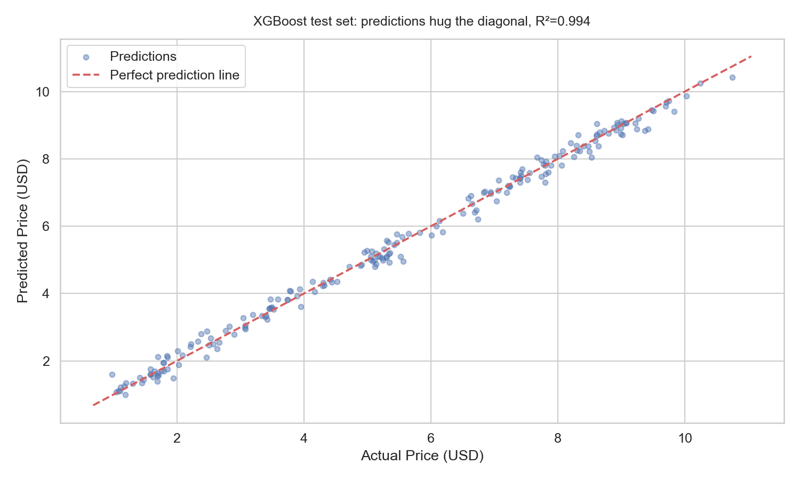
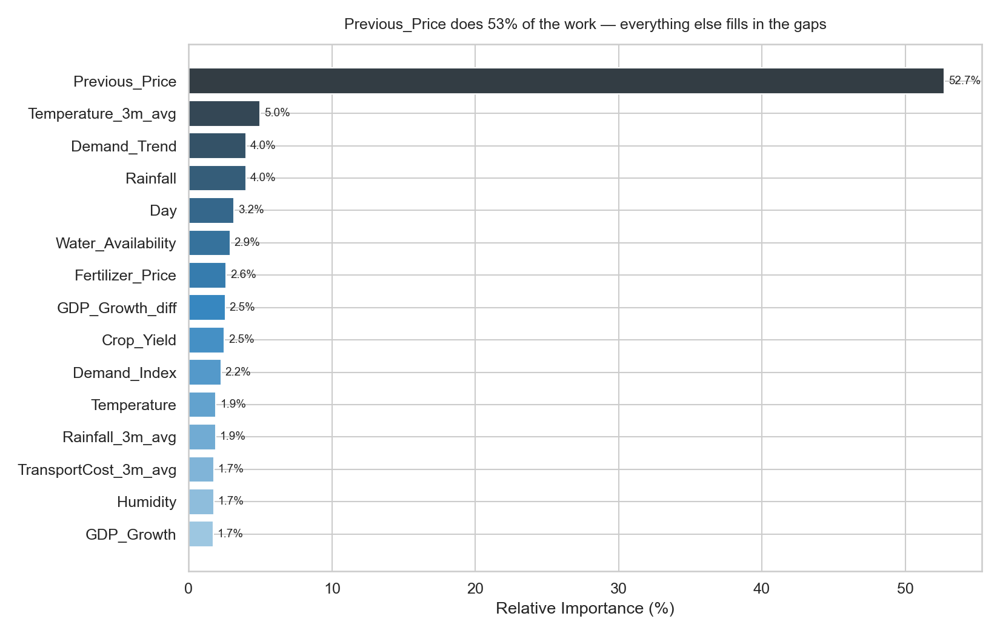
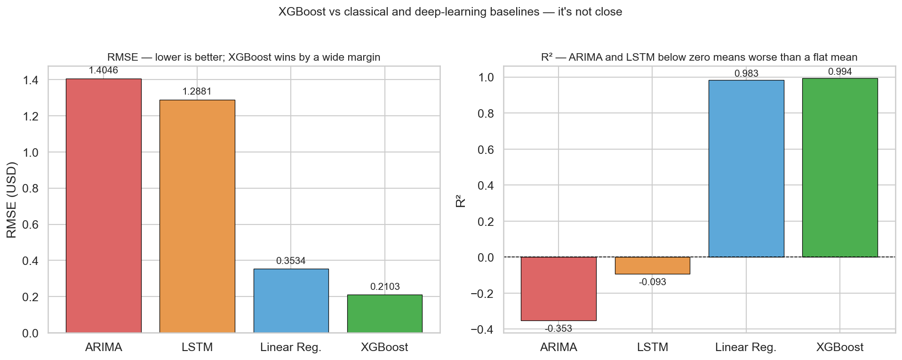

# Food Price Prediction using Time Series Analysis

> Predicting daily food prices for 10 grocery staples using economic, weather, and supply-chain signals — XGBoost achieves R²=0.994 and MAPE=4.27% on held-out data, outperforming both ARIMA and LSTM by a significant margin.


---

## The Problem

Food prices are volatile, and that volatility hits everyone in the supply chain — farmers planning harvests, retailers setting margins, and policymakers watching inflation. A model that can predict prices a few days out using economic and environmental signals could meaningfully improve procurement and pricing decisions. What makes this non-trivial: no single variable drives food prices. Weather affects supply, inflation affects input costs, and demand spikes during festive seasons. The signal is spread across 16 interacting variables, and it's mostly non-linear.

---

## The Dataset — and Why We Built It

No single real-world source had all the variables we needed at daily resolution. FAO price indices exist, but they don't come bundled with local weather, crop yield, and inflation in one clean table. So we generated our own: **1,000 observations spanning 2010–2023**, covering 10 food types (Tomato, Onion, Potato, Carrot, Beans, Apple, Strawberry, Banana, Orange, Grapes).

This turned out to be the hardest and most valuable part of the project. Every feature range had to be grounded in real-world literature — not just a number we made up. Our professor pushed back hard on several choices, which forced us to actually understand the economics before writing any code.

| Property | Detail |
|---|---|
| **Source** | Synthetically generated (team-designed, research-backed) |
| **Size** | 1,000 rows × 17 columns → 27 after feature engineering |
| **Target** | `Food_Price` in USD — range \$0.97 to \$10.75, mean \$5.47 |
| **Time span** | 2010–2023 (days capped at 1–28 to avoid month-length complexity) |
| **Missing values** | 0 |

**Feature design rationale (selected):**

| Feature | Range | Why This Range |
|---|---|---|
| Inflation_Rate | 1.0–10.98% | Covers stable economies (US ~2%) to high-inflation contexts |
| Exchange_Rate | 0.1–1.0 | Normalized ratio — simulates weak to strong currency environments |
| Crop_Yield | 2.03–10.0 tons/ha | Drought years (low yield) to bumper harvest (high) |
| Temperature | -5°C to 39.86°C | Full continental range — affects crop stress directly |
| Rainfall | 0.07–300mm | Near-drought to heavy monsoon |
| Demand_Index | 0.5–1.5 | Multiplier: 0.5 = crisis drop, 1.5 = festive surge |
| Transport_Cost | \$50–\$500/ton | Reflects fuel, distance, and infrastructure variation |

---

## Approach & Key Decisions

**Why these models, in this order:**
- **ARIMA** — classical baseline; quantifies what you lose by ignoring all 16 non-price features. Spoiler: you lose a lot.
- **LSTM** — tested the hypothesis that sequential dependencies could be learned from price history alone. The result killed that hypothesis with real numbers, not assumptions.
- **Linear Regression** — added as a sanity check after seeing r=0.991 between `Previous_Price` and the target. If a straight line gets R²=0.98, that's the honest bar XGBoost has to clear.
- **XGBoost** — chosen over Random Forest because sequential boosting corrects residual errors and has tighter regularisation controls for a small dataset (1,000 rows).

**Why temporal split, not random:**
Random split on time-ordered data lets future observations leak into training. I caught this early — random split gave XGBoost R²≈0.9999, which is a tell. Temporal 80/20 brought it to 0.9939. Still strong, but honest.

**Why MAPE as the secondary metric:**
Food items span different price ranges (\$1 bananas vs \$9 premium berries). MAPE gives a scale-free view. RMSE in USD is the operational metric — directly interpretable as "dollars off per prediction."

**What didn't work:**
- SMOTE-equivalent oversampling for rare high/low price events — improved extremes but degraded the \$2–\$9 range where 80% of predictions live. Dropped.
- `max_depth=6` for XGBoost — train RMSE dropped to 0.08, test RMSE rose to 0.25. Clear overfit on 1,000 rows. Dropped.
- Random train/test split — leaked future data into training. Abandoned immediately.

---

## Results

| Model | RMSE ↓ | MAE ↓ | MAPE ↓ | R² ↑ |
|---|---|---|---|---|
| ARIMA(5,1,0) | 1.4046 | 1.0788 | 22.87% | -0.3529 |
| LSTM (window=12) | 1.2881 | 1.0158 | 20.42% | -0.0934 |
| Linear Regression (baseline) | 0.3534 | 0.2757 | 5.08% | 0.9827 |
| **XGBoost (held-out test set)** | **0.2103** | **0.1635** | **4.27%** | **0.9939** |

XGBoost explains 99.4% of the variance in held-out price data with a mean error of \$0.16. Both ARIMA and LSTM perform *worse than predicting the mean price every time* — their negative R² values aren't a bug, they're the honest cost of ignoring the multivariate structure. Linear regression at R²=0.9827 is a strong baseline that XGBoost meaningfully clears.

---

## Key Visualizations

### Predictions vs actuals — held-out test set
Tight diagonal clustering, no systematic bias.



---

### What the model learned — feature importance
`Previous_Price` dominates at 52.7%. The second tier — `Temperature_3m_avg` (5%), `Demand_Trend` (4%), `Rainfall` (4%) — adds another 13%.



---

### All four models side by side



---

## Feature Engineering

10 features added on top of the 16 raw variables:

| Feature | Logic | Why It Matters |
|---|---|---|
| `Previous_Lag` | `Previous_Price.shift(1)` | Price momentum — single strongest predictor (r=0.991) |
| `Rainfall_3m_avg` | 3-row rolling mean | Smooths daily weather noise; captures sustained wet/dry periods |
| `Temperature_3m_avg` | 3-row rolling mean | Sustained heat stress matters more than a single hot day |
| `TransportCost_3m_avg` | 3-row rolling mean | Logistics costs don't flip overnight |
| `GDP_Growth_diff` | First difference | Economic acceleration vs level — different signals for price |
| `Demand_Trend` | First difference | A rising Demand_Index predicts spikes; a flat one doesn't |
| `Rainfall_Demand` | Rainfall × Demand_Index | Weather disruption during high-demand = compounded price spike |
| `Temp_Crop` | Temperature × Crop_Yield | Heat stress interacts with supply volume non-linearly |
| `Rainfall_Temp` | Rainfall × Temperature | Combined climate stress — neither alone captures this |
| `Yield_Demand` | Crop_Yield × Demand_Index | Supply-demand balance as a single input signal |

---

## What Didn't Work (and What I Did About It)

**Challenge 1 — Designing the dataset from scratch**

The problem wasn't generating random numbers — it was making them meaningful. Our first attempt used uniform random sampling. The resulting correlations were completely unrealistic (Temperature negatively correlated with Crop_Yield at -0.45, which only makes sense in a desert). We rebuilt every feature distribution using ranges from published sources: USDA crop yield reports, FAO transport indices, IMF inflation data. The professor's pushback sessions on the dataset design were, honestly, more valuable than any model result.

**Challenge 2 — SMOTE for extreme price events**

Prices above \$9 and below \$1.50 are underrepresented — fewer than 50 rows each. I tried oversampling these synthetically to improve extreme-range predictions. It worked at the extremes but degraded the \$2–\$9 range where most real predictions live. I dropped it and acknowledged the limitation in error analysis instead of papering over it with inflated metrics.

**Challenge 3 — The CV vs test RMSE gap (1.22 vs 0.21)**

First time I saw this gap I thought there was a bug. TimeSeriesSplit Fold 1 trains on ~160 rows — too few to learn the interaction patterns. By Fold 5 (800+ training rows), RMSE drops to 1.03. The held-out 80/20 split is the representative evaluation. Both numbers are reported and explained.

---

## Prediction Interval Analysis

At RMSE = \$0.21 and MAPE = 4.27%:

| Price Level | Expected Error (±1 RMSE) | As % of Price |
|---|---|---|
| \$1.50 item | ±\$0.21 | 14% |
| \$3.00 item | ±\$0.21 | 7% |
| \$5.50 item (average) | ±\$0.21 | 3.8% |
| \$9.00 item | ±\$0.21 | 2.3% |

For retail planning and procurement budgeting, ±\$0.21 on a \$5.50 item is workable. For intraday decisions or tight-margin scenarios, it isn't. This is a planning tool, not a trading signal.

---

## Experiment Log

| # | Experiment | Change | Before | After | Decision |
|---|---|---|---|---|---|
| 01 | ARIMA baseline | Univariate price series | — | RMSE=1.40, R²=-0.35 | Kept as lower bound |
| 02 | LSTM (window=12) | Monthly series, univariate | RMSE=1.40 | RMSE=1.29, R²=-0.09 | Kept for comparison |
| 03 | Linear Regression | All 27 features | — | RMSE=0.35, R²=0.98 | Strong baseline |
| 04 | XGBoost default | No tuning | RMSE=0.35 | RMSE=0.22, R²=0.99 | Kept |
| 05 | Interaction features | Temp×Crop, Rainfall×Demand | RMSE=0.22 | RMSE=0.21 | Kept |
| 06 | SMOTE oversampling | Oversample extreme price rows | RMSE=0.21 | Middle-range degraded | Dropped |
| 07 | Random split | Shuffle before split | — | R²≈0.9999 (leaking) | Dropped immediately |
| 08 | max\_depth=6 | Deeper trees | RMSE=0.21 | Test RMSE=0.25 (overfit) | Dropped |

---

## Assumptions & Limitations

- **Synthetic data.** This model has never seen real FAO or USDA prices. Real-world validation is the critical missing step before any operational use.
- **`Previous_Price` dependency.** 53% of predictive power comes from yesterday's price. If unavailable, performance drops to linear regression territory.
- **No exogenous shock variables.** Geopolitical events, natural disasters, and policy changes aren't in the model. The worst predictions all involve simultaneous high-Rainfall + extreme Demand_Index combinations.
- **Concept drift.** Trained on 2010–2023 patterns. Post-2022 supply chain restructuring would require retraining.
- **No per-food-type granularity.** Strawberries and potatoes respond differently to the same weather event.

---

## Model Card

| Property | Detail |
|---|---|
| **Intended use** | Short-range (1–3 day) food price forecasting for retail planning and procurement |
| **Not suitable for** | Intraday trading, financial instruments, policy decisions |
| **Training data** | Synthetic, 2010–2023, 1,000 observations, research-backed feature ranges |
| **Performance** | RMSE=\$0.21, MAPE=4.27%, R²=0.994 (temporal 80/20 split) |
| **Key dependency** | Requires `Previous_Price` as input; degrades without it |
| **Known limitations** | Synthetic training data; no shock variables; underperforms at price extremes |

---

## What I'd Do Next

1. **Validate against real FAO/USDA data.** That's the only way to know if the synthetic feature design actually generalises.
2. **Multivariate LSTM with daily features.** The current LSTM sees only the univariate monthly series — all 16 features were discarded. A proper multivariate daily LSTM would be a fairer comparison.
3. **Price velocity features.** Rolling 7-day and 30-day rate-of-change were on the list but cut due to dataset size.
4. **Quantile regression for prediction intervals.** XGBoost supports quantile loss — confidence bands are more useful than point forecasts for procurement planning.
5. **Per-food-type stratified models.** One model for all 10 food types is a simplification that a production system wouldn't make.

---

## How to Run

```bash
git clone https://github.com/rahulb0206/Food-Price-Prediction-using-Time-Series-Analysis
cd Food-Price-Prediction-using-Time-Series-Analysis
pip install -r requirements.txt

# Explore the project
jupyter notebook notebooks/01_eda.ipynb

# Run full pipeline
python src/preprocess.py    # → data/processed/engineered_dataset.csv
python src/train.py         # → outputs/models/ (all three models)
python src/evaluate.py      # → prints full metrics comparison table

# Run tests
python -m pytest tests/ -v
```

---

## Project Structure

```
Food-Price-Prediction-using-Time-Series-Analysis/
├── data/
│   ├── raw/                         ← Original synthetic dataset (1000 × 17)
│   └── processed/                   ← Engineered dataset (1000 × 27)
├── notebooks/
│   ├── 01_eda.ipynb                 ← Data exploration and key findings
│   ├── 02_preprocessing.ipynb      ← Feature engineering and split decisions
│   ├── 03_modeling.ipynb           ← ARIMA, LSTM, Linear Regression, XGBoost
│   └── 04_evaluation.ipynb         ← Metrics, error analysis, business impact
├── src/
│   ├── preprocess.py               ← Feature engineering pipeline (importable)
│   ├── train.py                    ← Train all three model types
│   └── evaluate.py                 ← Metrics computation and comparison table
├── outputs/
│   ├── figures/                    ← All 10 saved plots
│   └── models/                     ← Saved model artifacts (.pkl, .h5)
├── tests/
│   └── test_pipeline.py            ← 14 unit tests (all passing)
├── requirements.txt
├── .gitignore
└── README.md
```

---

## Tech Stack

- **Core:** Python 3.10, pandas 2.1, numpy 1.26
- **ML:** scikit-learn 1.5, XGBoost 2.1
- **Deep Learning:** TensorFlow 2.16 / Keras
- **Time Series:** statsmodels 0.14
- **Visualisation:** matplotlib 3.8, seaborn 0.13
- **Persistence:** joblib 1.4

---

## References

1. Box, G. E. P., & Jenkins, G. M. (1976). *Time Series Analysis: Forecasting and Control.* Holden-Day.
2. Hochreiter, S., & Schmidhuber, J. (1997). Long Short-Term Memory. *Neural Computation, 9*(8), 1735–1780.
3. Chen, T., & Guestrin, C. (2016). XGBoost: A Scalable Tree Boosting System. *KDD '16.*
4. FAO (2023). *GIEWS — Global Information and Early Warning System on Food and Agriculture.*
5. USDA Economic Research Service. *Food Price Outlook and Agricultural Statistics.*
